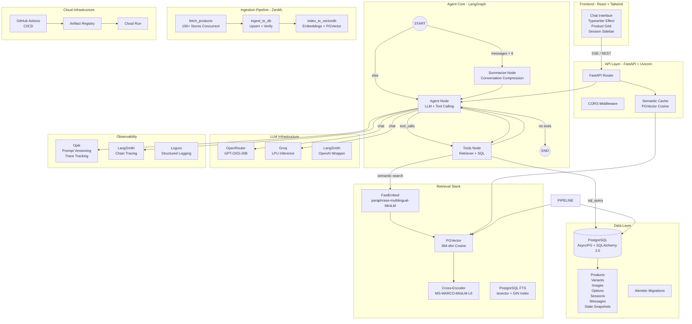
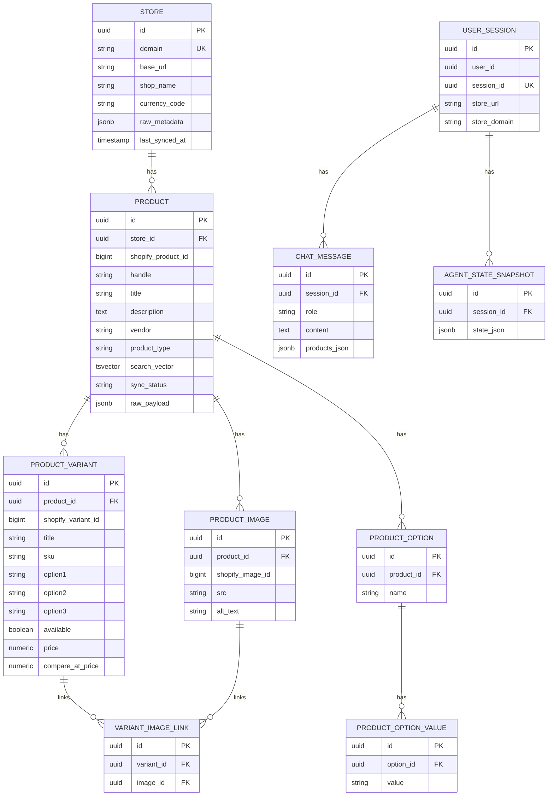
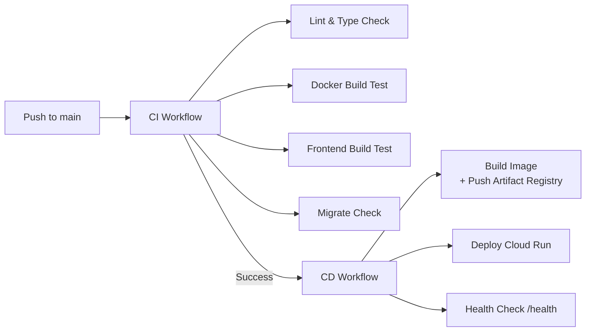

<div align="center">


# **Shopify Shopping Assistant Agent**

### *An Intelligent, Multi-Lingual AI Shopping Concierge for Egyptian E-Commerce*

[](https://www.python.org/)
[](https://fastapi.tiangolo.com/)
[](https://react.dev/)
[](https://www.postgresql.org/)
[](https://cloud.google.com/)
[](https://supabase.com/)
[](https://zenml.io/)

</div>

---

## Overview

**Shopify Shopping Assistant Agent** is a production-grade AI shopping concierge that intelligently searches, compares, and recommends products across **100+ Shopify stores in Egypt**. Built with a sophisticated **LangGraph agent architecture**, it combines **semantic vector search**, **cross-encoder reranking**, **score threshold filtering**, and **real-time streaming** to deliver an unmatched multi-lingual shopping experience.

The system handles both **Arabic (Egyptian dialect)** and **English** queries, persists full conversation context across sessions in **Supabase PostgreSQL**, and leverages **ZenML Cloud** for automated weekly ingestion pipelines that keep the product catalog fresh.

---

## Star Features

<div align="center">

| Feature | Badge |
|---------|-------|
| **LangGraph Multi-Agent Architecture** | [](https://langchain-ai.github.io/langgraph/) |
| **Hybrid Search (Vector + Full-Text)** | []() |
| **Cross-Encoder Re-Ranking** | []() |
| **Score Threshold Filtering** | []() |
| **Semantic Cache** | []() |
| **Session Management & State Snapshots** | []() |
| **Streaming SSE Responses** | []() |
| **Multi-Language Support** | []() |
| **100+ Store Ingestion Pipeline** | []() |
| **Prompt Versioning & Observability** | []() |
| **LLM Routing (OpenRouter / Groq)** | []() []() |
| **GCP Cloud Run Deployment** | []() |
| **CI/CD with GitHub Actions** | []() |

</div>

---

## System Architecture



---

## Complete Tech Stack

### Backend

| Technology | Purpose | Badge |
|------------|---------|-------|
| **Python 3.13** | Core runtime |  |
| **FastAPI** | High-performance async API framework |  |
| **Uvicorn** | ASGI server |  |
| **Pydantic v2** | Data validation & settings management |  |
| **Pydantic Settings** | Environment-based configuration |  |
| **SQLAlchemy 2.0** | Async ORM with type-safe Mapped columns |  |
| **SQLModel** | SQLAlchemy + Pydantic integration |  |
| **Alembic** | Database migrations |  |
| **AsyncPG** | Ultra-fast async PostgreSQL driver |  |
| **Psycopg2** | Sync PostgreSQL adapter |  |

### AI / ML / LLM

| Technology | Purpose | Badge |
|------------|---------|-------|
| **LangGraph** | Stateful agent graph with cycles |  |
| **LangChain** | LLM abstractions & tool binding |  |
| **LangChain OpenAI** | OpenAI-compatible chat models |  |
| **OpenAI SDK** | Client for OpenRouter & Groq |  |
| **OpenRouter** | Unified API for 100+ LLMs |  |
| **Groq** | LPU-based ultra-fast inference |  |
| **FastEmbed** | On-device embedding generation |  |
| **Sentence Transformers** | Cross-encoder reranker model |  |

### Vector & Search

| Technology | Purpose | Badge |
|------------|---------|-------|
| **PGVector** | Vector similarity search inside PostgreSQL |  |
| **Qdrant Client** | Alternative vector DB client |  |
| **Cross-Encoder (MS-MARCO-MiniLM-L6)** | Re-ranking retrieved products |  |
| **Multilingual MiniLM (L12)** | Query/product embeddings |  |

### Data & Storage

| Technology | Purpose | Badge |
|------------|---------|-------|
| **Supabase** | Managed PostgreSQL with Connection Pooler |  |
| **PostgreSQL** | Primary relational database (hosted on Supabase) |  |
| **PGVector Extension** | Vector storage & HNSW index (Supabase-native) |  |
| **Alembic** | Schema versioning & migrations |  |

### Observability & Monitoring

| Technology | Purpose | Badge |
|------------|---------|-------|
| **Opik** | LLM prompt versioning & trace tracking |  |
| **LangSmith** | LangChain chain tracing & evaluation |  |
| **Loguru** | Structured, colorized logging |  |

### MLOps & Pipeline

| Technology | Purpose | Badge |
|------------|---------|-------|
| **ZenML** | ML pipeline orchestration |  |
| **ZenML Cloud** | Remote execution & weekly scheduling |  |

### Frontend

| Technology | Purpose | Badge |
|------------|---------|-------|
| **React 18** | UI library |  |
| **Vite** | Build tool & dev server |  |
| **Tailwind CSS** | Utility-first styling |  |
| **Material Symbols** | Google's icon font |  |

### DevOps & Cloud

| Technology | Purpose | Badge |
|------------|---------|-------|
| **Docker** | Containerization |  |
| **Google Cloud Run** | Serverless container hosting |  |
| **Artifact Registry** | Docker image storage |  |
| **GitHub Actions** | CI/CD automation |  |
| **UV** | Ultra-fast Python package manager |  |

---

## Deep Dive into Key Components

### 1. LangGraph Agent Architecture

The agent is built on **LangGraph** with a cyclical state machine:

```
START -> Summarize (if >8 messages) -> Agent Node -> [Tool Call?] -> Tools -> Agent -> END
```

- **Agent Node**: LLM with `bind_tools()` for structured tool calling
- **Tools Node**: Executes either `product_retriever` or `sql_query`
- **Summarize Node**: Compresses conversation history to save context window
- **State**: `messages`, `summary`, `products`, `product_ids`, `steps`, `product_sets`

The agent uses **two specialized tools**:

| Tool | Purpose | Trigger |
|------|---------|---------|
| `product_retriever` | Semantic vector search across all stores | User asks for NEW products |
| `sql_query` | Query product details (variants, images, options) | User asks about ALREADY found products |

### 2. Hybrid Search + Re-Ranking Pipeline

```
User Query
    |
    v
FastEmbed (Multilingual MiniLM-L12) → 384-dim Vector
    |
    v
PGVector Cosine Search → Top 20 Candidates
    |
    v
Cross-Encoder (MS-MARCO-MiniLM-L6-v2) Re-Ranking
    |
    v
Score Threshold Filter (≥ -7.5)
    |
    v
Top-K Products with Confidence Score
```

**Score Threshold Filter**: Any product with a reranker score below -7.5 is discarded. This eliminates noise while keeping well-scored relevant results.

### 3. Semantic Cache

A **PGVector-based semantic cache** stores previous query-response pairs:
- **Similarity Threshold**: 0.92 cosine similarity for cache hits
- **TTL**: 24 hours with automatic expiration
- **Store-Domain Isolation**: Cache entries scoped per Shopify store
- **Fallback**: Cache is bypassed when the user already has product context in the session

### 4. Session Management

Full **multi-session chat history** with PostgreSQL:

```sql
user_sessions ──► chat_messages
        │
        └──► agent_state_snapshots (LangGraph state persistence)
```

- **User Sessions**: UUID-based sessions with store-domain binding
- **Chat Messages**: Full conversation history with embedded product JSON
- **State Snapshots**: Serialized LangGraph agent state for seamless conversation restoration
- **Async Repositories**: All DB operations use SQLAlchemy 2.0 async patterns

### 5. Product Ingestion at Scale

**ZenML Pipeline** runs weekly on ZenML Cloud to ingest ~100 Egyptian Shopify stores:

```python
@pipeline(name="shopify_ingestion_pipeline")
def shopify_ingestion_pipeline():
    store_products = fetch_products()      # Concurrent HTTP/2 fetching
    ingest_result = ingest_to_db(store_products)   # Upsert + verify counts
    index_result = index_to_vectordb(store_products, ingest_result)  # Embed + index
```

- **Concurrency**: Semaphore-limited async fetching (max 10 parallel)
- **Resilience**: Timeouts and graceful skipping for unreachable stores
- **Verification**: Post-ingest COUNT(*) on all related tables
- **Embeddings**: `sentence-transformers/paraphrase-multilingual-MiniLM-L12-v2`
- **Payload Enrichment**: Extracts materials, care instructions, sizing info from HTML descriptions

### 6. Multi-Language Intelligence

The agent **auto-detects and mirrors** the user's language and dialect:
- **Egyptian Arabic** → Replies in Egyptian Arabic slang
- **Levantine Arabic** → Replies in Levantine dialect
- **English** → Replies in English
- **Query Cleaning**: Strips gender modifiers (woman/men/kids) from vector search while preserving them for reranking

### 7. Observability Stack

Every LLM call, tool execution, and reranking operation is traced:

| Layer | Tool | What It Tracks |
|-------|------|----------------|
| LLM Calls | **Opik** + **LangSmith** | Input messages, output tokens, latency |
| Agent Nodes | **Opik `@track`** | Agent node, summarize node, tools node |
| Tool Calls | **Opik `@track`** | Retriever, reranker, SQL query |
| Prompts | **Opik Prompt Versioning** | System prompt, summarize prompts |
| API Requests | **Loguru Middleware** | Method, path, status, duration (ms) |
| Pipelines | **ZenML Dashboard** | Step runs, schedules, artifacts |

### 8. Streaming SSE Frontend

Real-time streaming with **Server-Sent Events**:
- **Typewriter Effect**: Characters appear one-by-one with 10ms delay
- **Live Step Indicators**: Animated tool status (searching → reranking → done)
- **Trace Panel**: Expandable step-by-step execution log with icons
- **Product Grid**: Animated cards with hover zoom, "Best Match" badge, direct checkout links
- **Session Sidebar**: Create, switch, and delete sessions with persisted history

---

## Project Structure

```
shopify-shopping-assistant-agent/
├── .github/
│   └── workflows/
│       ├── ci.yml                 # Lint, type-check, Docker validation, frontend build
│       └── cd.yml                 # Build image → Artifact Registry → Cloud Run deploy
│
├── frontend/                      # React + Vite + Tailwind CSS
│   ├── src/
│   │   ├── pages/
│   │   │   └── ChatPage.jsx       # Main chat UI with streaming, products grid, sessions
│   │   ├── components/
│   │   │   ├── ChatMessage.jsx    # Message bubbles
│   │   │   ├── ChatInput.jsx      # Textarea input
│   │   │   ├── ProductCard.jsx    # Product recommendation cards
│   │   │   ├── Navbar.jsx         # Top navigation
│   │   │   └── Footer.jsx         # Footer
│   │   ├── App.jsx                # Root component
│   │   ├── main.jsx               # Entry point
│   │   └── index.css              # Tailwind directives + custom animations
│   ├── index.html
│   ├── package.json
│   ├── vite.config.js
│   ├── tailwind.config.js
│   └── postcss.config.js
│
├── pipelines/                     # ZenML ingestion pipeline
│   ├── pipeline.py                # Pipeline definition (fetch → ingest → index)
│   ├── run.py                     # CLI runner (--no-cache, --schedule)
│   └── steps/
│       ├── fetch_products.py      # Async HTTP fetch from 100+ stores
│       ├── ingest_to_db.py        # Upsert products/variants/images/options
│       └── index_to_vectordb.py   # Generate embeddings & insert into PGVector
│
├── src/
│   ├── __init__.py
│   ├── config.py                  # Pydantic Settings (Postgres, LLM, Search, Cache, CORS)
│   │
│   ├── agent/                     # LangGraph Agent Core
│   │   ├── __init__.py
│   │   ├── agent.py               # ShoppingAgent class (chat, stream, session-aware)
│   │   ├── graph.py               # StateGraph builder (START → Summarize → Agent → Tools → END)
│   │   ├── nodes.py               # Agent node, Summarize node, Tools node
│   │   ├── states.py              # AgentState TypedDict
│   │   └── tools.py               # ProductRetriever + SQLQueryTool
│   │
│   ├── api/                       # FastAPI Application
│   │   ├── __init__.py
│   │   ├── main.py                # App factory, lifespan, middleware, dependency injection
│   │   ├── dependencies.py        # FastAPI Depends providers
│   │   ├── routes/
│   │   │   ├── __init__.py
│   │   │   ├── chat_routes.py     # POST /chat, POST /chat/stream, session CRUD
│   │   │   └── system_routes.py   # Health checks
│   │   ├── schemas/
│   │   │   ├── __init__.py
│   │   │   ├── chat.py            # ChatRequest, ChatResponse, Session models
│   │   │   └── indexing.py        # Indexing request/response schemas
│   │   └── services/
│   │       ├── semantic_cache_service.py   # PGVector semantic cache with TTL
│   │       ├── indexing_service.py         # Product → vector payload builder
│   │       └── store_ingestion_service.py  # Store-level ingestion logic
│   │
│   ├── db/                        # Database Layer
│   │   ├── __init__.py
│   │   ├── base.py                # SQLAlchemy declarative base
│   │   ├── factory.py             # DatabaseFactory (sync + async engines)
│   │   ├── session.py             # Async session context manager
│   │   ├── models/
│   │   │   ├── __init__.py
│   │   │   ├── products_details.py        # Store, Product, Variant, Image, Option, OptionValue
│   │   │   └── session_models.py          # UserSession, ChatMessage, AgentStateSnapshot
│   │   ├── repositories/
│   │   │   ├── __init__.py
│   │   │   ├── product_repository.py      # Upsert products from Shopify payload
│   │   │   └── session_repository.py      # Session, message, state snapshot CRUD
│   │   ├── interfaces/
│   │   │   ├── __init__.py
│   │   │   └── base_repository.py         # Generic async repository interface
│   │   └── migration/
│   │       ├── env.py
│   │       ├── alembic.ini
│   │       └── versions/
│   │           ├── 20260425_0001_create_shopify_schema.py
│   │           ├── 20260425_0002_products_description_column.py
│   │           ├── 20260503_0001_add_session_chat_state_tables.py
│   │           └── 20260507_0001_add_products_search_vector.py   # tsvector + GIN for FTS
│   │
│   ├── infrastructure/            # Infrastructure Adapters
│   │   ├── __init__.py
│   │   ├── llm/
│   │   │   ├── __init__.py
│   │   │   ├── interface.py       # LLMInterface abstract class
│   │   │   ├── factory.py         # LLMFactory (Groq / OpenRouter)
│   │   │   ├── enum.py            # LLMProviderEnums
│   │   │   ├── langchain_adapter.py
│   │   │   └── providers/
│   │   │       ├── __init__.py
│   │   │       ├── groq.py        # Groq provider with structured output
│   │   │       └── openrouter.py  # OpenRouter provider with structured output
│   │   └── vectordb/
│   │       ├── __init__.py
│   │       ├── interface.py       # VectorDBInterface abstract class
│   │       ├── factory.py         # VectorDBFactory singleton
│   │       ├── enum.py            # DistanceMetric, IndexType enums
│   │       └── providers/
│   │           ├── __init__.py
│   │           ├── pgvector.py    # Full PGVector provider (CRUD, HNSW index)
│   │           └── qdrant.py      # Qdrant provider (alternative)
│   │
│   ├── observability/             # Observability Layer
│   │   ├── __init__.py
│   │   ├── opik_utils.py          # Opik configuration & project setup
│   │   └── prompt_versioning.py   # Prompt class with Opik versioning fallback
│   │
│   ├── prompts/                   # Prompt Engineering
│   │   ├── __init__.py
│   │   └── prompts.py             # SYSTEM_PROMPT, SUMMARIZE_PROMPT, DB_SCHEMA
│   │
│   └── utils/                     # Utilities
│       ├── embedding_service.py   # FastEmbed singleton (multilingual MiniLM)
│       ├── reranker_service.py    # Cross-encoder singleton (MS-MARCO)
│       ├── product_search_processor.py  # HTML cleaning, material extraction, payload builder
│       └── logger_util.py         # Loguru structured logging setup
│
├── Dockerfile                     # Multi-stage Python 3.13 slim image
├── pyproject.toml                 # UV-managed dependencies
├── requirements.txt               # Exported for Docker
├── alembic.ini                    # Alembic configuration
├── .env.example                   # Environment variables template
└── README.md                      # This file
```

---

## Database Schema



---

## CI/CD Pipeline



---

## Quick Start

### Prerequisites

- Python 3.13+
- **Supabase** project (or PostgreSQL 14+ with `pgvector` extension)
- UV package manager (`pip install uv`)
- Node.js 20+ (for frontend)

### 1. Clone & Install

```bash
git clone https://github.com/yourusername/shopify-shopping-assistant-agent.git
cd shopify-shopping-assistant-agent

# Backend
uv sync

# Frontend
cd frontend
npm install
```

### 2. Environment Variables

```bash
cp .env.example .env
```

```env
# Database (Supabase)
POSTGRES__HOST=aws-0-eu-west-1.pooler.supabase.com
POSTGRES__PORT=6543
POSTGRES__DATABASE=postgres
POSTGRES__USER=postgres.<your-project-ref>
POSTGRES__PASSWORD=your-supabase-password
POSTGRES__SSLMODE=require

# Qdrant Configuration
QDRANT__ENVIRONMENT=local
QDRANT__HOST=localhost
QDRANT__PORT=6333
QDRANT__COLLECTION_NAME=products

# Docker Postgres bootstrap vars (required by postgres image)
POSTGRES_DB=shopify_assistant
POSTGRES_USER=shopify_user
POSTGRES_PASSWORD=change_me

# LLM
OPENROUTER_API__KEY=your-openrouter-key-here
GROQ_API__KEY=your-groq-key-here
LLM__PROVIDER=openrouter
LLM_MODEL__NAME=openai/gpt-oss-20b:nitro

# Observability
OPIK__API_KEY=your-opik-key-here
OPIK__PROJECT_NAME=shopify-shopping-assistant-agent

# Search
SEARCH__USE_HYBRID_SEARCH=true
```

### 3. Database Setup

**Option A: Supabase (Recommended)**

1. Create a project at [supabase.com](https://supabase.com)
2. Enable the **Vector** extension in Database → Extensions
3. Copy the **Connection Pooler** URL for your `.env`

**Option B: Local PostgreSQL**

```bash
# Create database & enable pgvector
createdb shopify_assistant
psql shopify_assistant -c "CREATE EXTENSION IF NOT EXISTS vector;"
```

**Run Migrations**

```bash
uv run alembic -c src/db/migration/alembic.ini upgrade head
```

### 4. Run

```bash
# Backend
uv run uvicorn src.api.main:app --reload --port 8000

# Frontend (new terminal)
cd frontend
npm run dev
```

Open `http://localhost:5173`

### 5. Run Ingestion Pipeline (First Time)

```bash
# Local run
uv run python -m pipelines.run --no-cache

# Or schedule on ZenML Cloud (one-time setup)
zenml connect --url https://<tenant>.zenml.io --api-key <key>
zenml stack set zenml-cloud-remote
python -m pipelines.run --schedule
```

---

## API Endpoints

| Method | Endpoint | Description |
|--------|----------|-------------|
| `POST` | `/chat/sessions` | Create a new chat session |
| `GET` | `/chat/sessions` | List sessions for a user |
| `GET` | `/chat/sessions/{id}/messages` | Get session message history |
| `DELETE` | `/chat/sessions/{id}` | Delete a session |
| `POST` | `/chat` | Non-streaming chat (with caching) |
| `POST` | `/chat/stream` | **Streaming SSE chat** (typewriter effect) |
| `GET` | `/health` | Health check + dependency status |

---

## Deployment

### Google Cloud Run

```bash
# Build & push
docker build -t gcr.io/PROJECT/shopify-assistant:latest .
docker push gcr.io/PROJECT/shopify-assistant:latest

# Deploy
gcloud run deploy shopify-assistant \
  --image gcr.io/PROJECT/shopify-assistant:latest \
  --region us-central1 \
  --platform managed \
  --allow-unauthenticated \
  --set-env-vars "POSTGRES__HOST=...,OPENROUTER_API__KEY=..."
```

The included **GitHub Actions CD workflow** automates this on every push to `main`.


---


</div>
